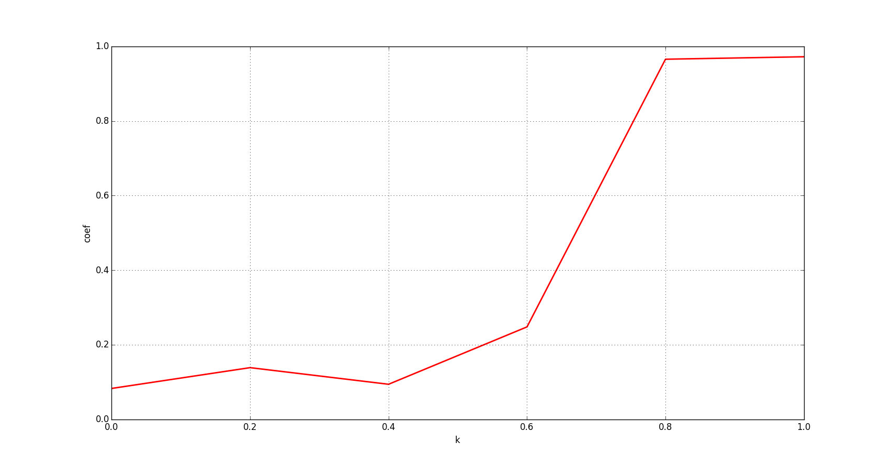
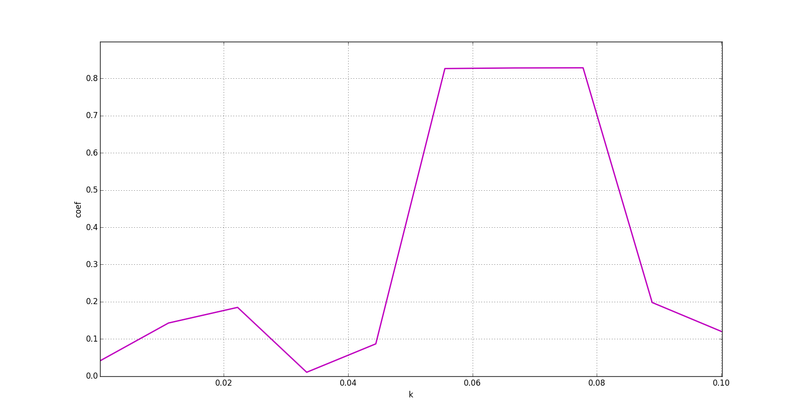

# Phase Synchronization 

## Description

We are going to use two systems for analysis: Van der Pol oscillator and Rossler system.

## Motivation

## Results

Phase synchronization coefficient for Van der Pol oscillator

Phase synchronization coefficient for Rossler system

## Learn more

- [Wiki Phase Synchronization](https://en.wikipedia.org/wiki/Phase_synchronization)
- [Wiki Van der Pol](https://en.wikipedia.org/wiki/Van_der_Pol_oscillator)
- [Van der Pol](http://www.scholarpedia.org/article/Van_der_Pol_model)
- [Wiki Rossler system](https://en.wikipedia.org/wiki/R%C3%B6ssler_attractor)

## Installation

You can use [Python](https://www.python.org/) with data package: [Anaconda](https://www.anaconda.com/) or [Miniconda](https://conda.io/miniconda).
There's another way - use [Portable Python](http://portablepython.com/). Also you can use whatever IDE for Python.

## License

Free